# DIAGRAMAS DE ARQUITECTURA - PF & PO Modules

**Proyecto**: Nexus Production Facilities & Optimization
**Versión**: 1.0
**Fecha**: 2026-02-03
**Herramientas**: Mermaid, PlantUML

---

## 📋 Índice

1. [Arquitectura General](#arquitectura-general)
2. [Modelo de Datos (ERD)](#erd)
3. [Flujos de Datos](#flujos)
4. [Secuencias de Operación](#secuencias)
5. [Despliegue](#despliegue)

---

## 1. Arquitectura General {#arquitectura-general}

### 1.1 Arquitectura de Capas (Mermaid)

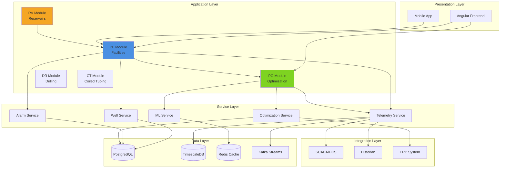

### 1.2 Arquitectura de Módulos PF y PO

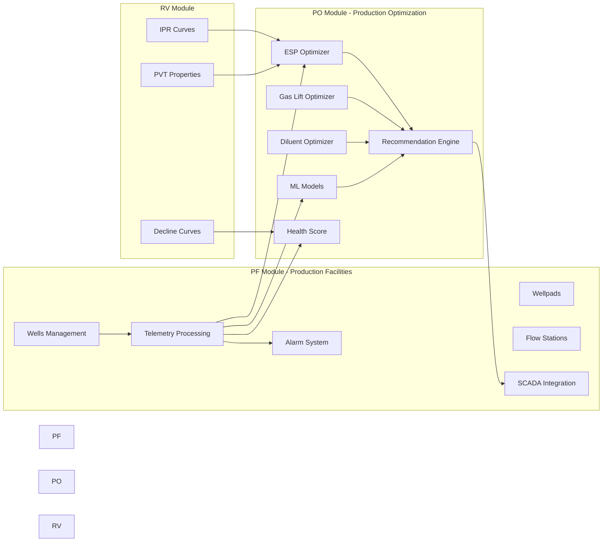

---

## 2. Modelo de Datos (ERD) {#erd}

### 2.1 Entidades Principales PF Module

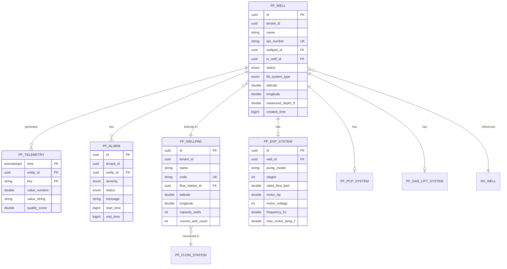

### 2.2 Entidades Principales PO Module

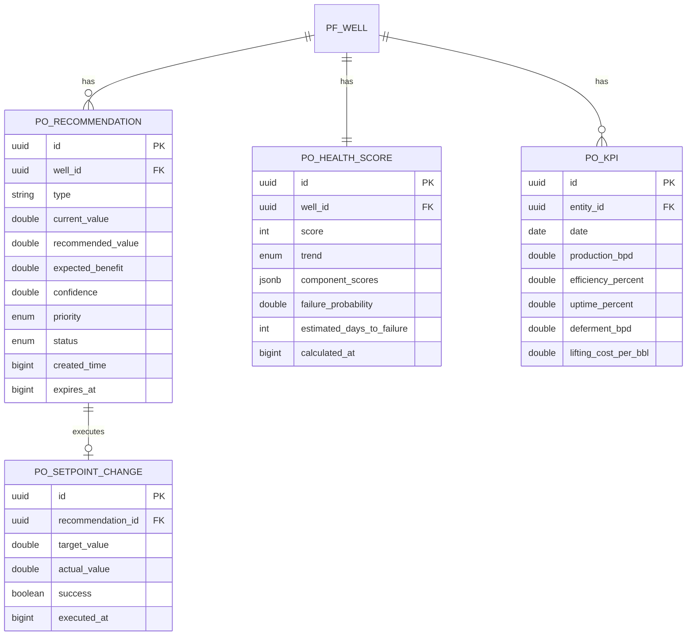

---

## 3. Flujos de Datos {#flujos}

### 3.1 Flujo de Telemetría (MQTT → Storage)

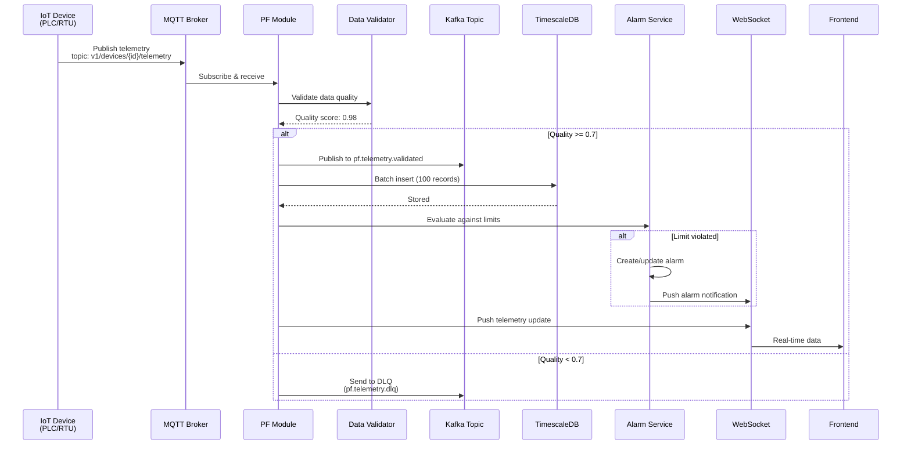

### 3.2 Flujo de Optimización ESP

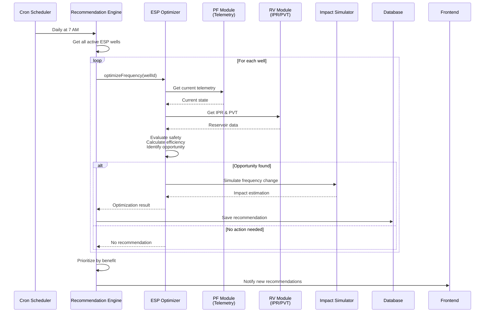

### 3.3 Flujo de Predicción de Fallas

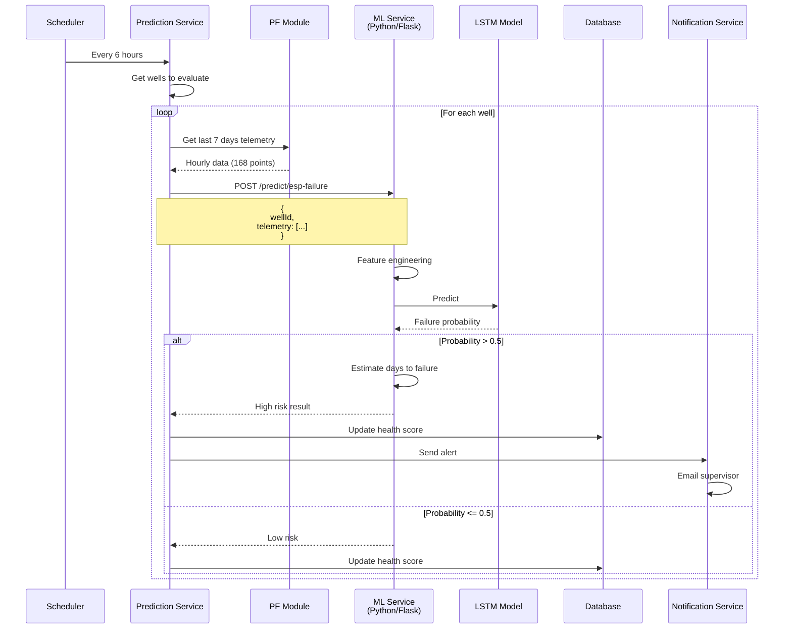

### 3.4 Flujo de Ejecución de Recomendación

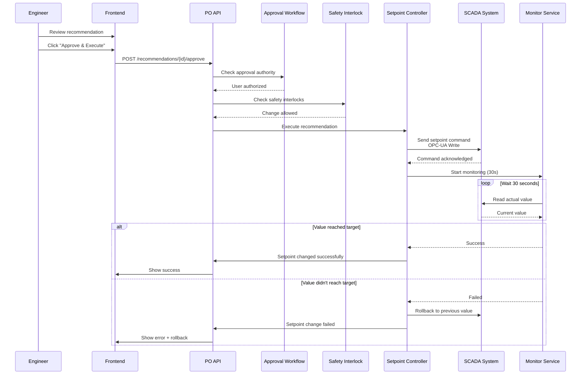

---

## 4. Secuencias de Operación {#secuencias}

### 4.1 Creación de Pozo (PlantUML)

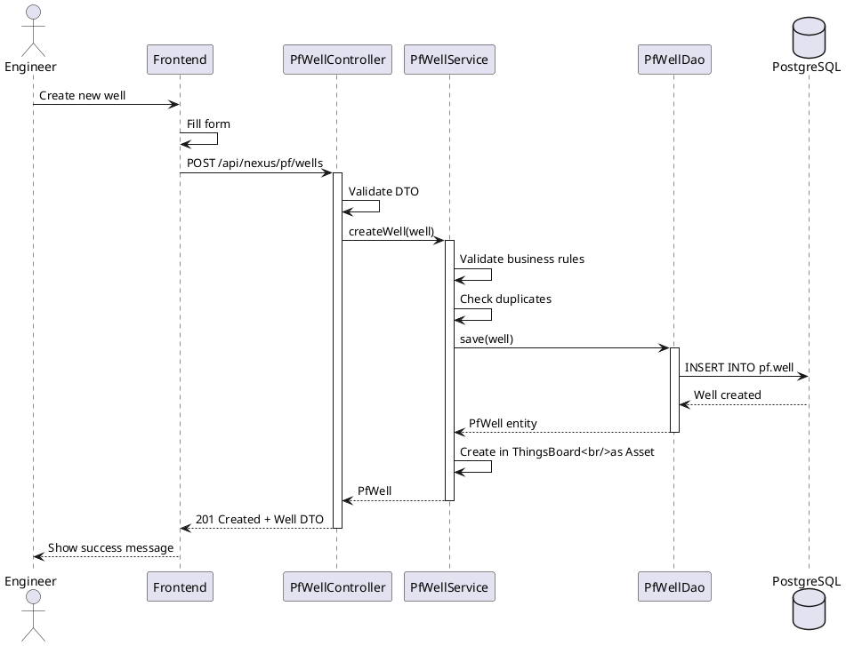

### 4.2 Ciclo de Optimización Diario (PlantUML)

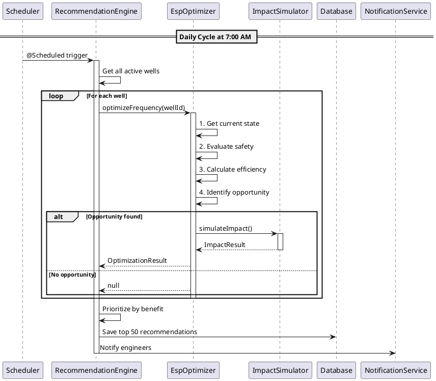

---

## 5. Despliegue {#despliegue}

### 5.1 Arquitectura de Despliegue (Kubernetes)

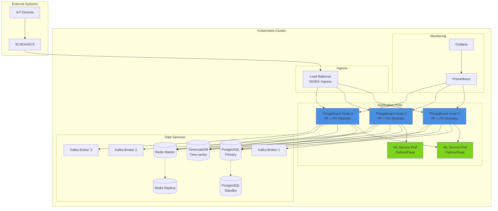

### 5.2 Topología de Red

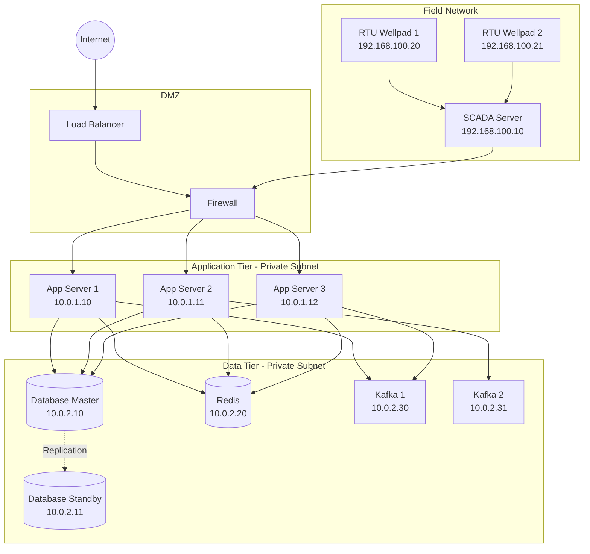

---

## 6. Diagramas de Estado

### 6.1 Estados de Recomendación

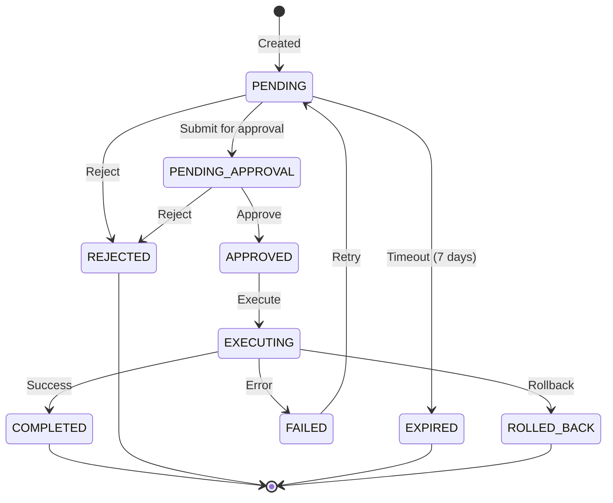

### 6.2 Estados de Alarma

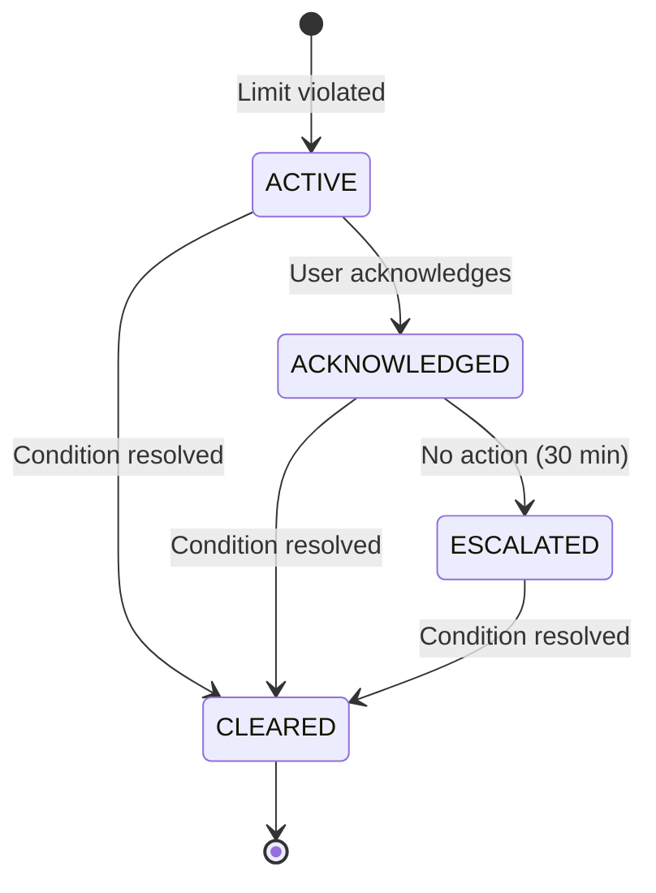

---

## 7. Componentes Frontend

### 7.1 Arquitectura de Componentes Angular

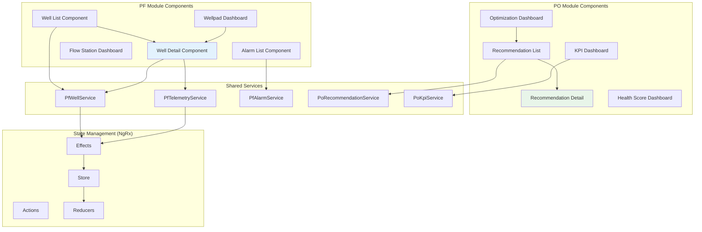

---

## Uso de los Diagramas

### Renderizar Diagramas Mermaid
Los diagramas Mermaid se renderizan automáticamente en:
- GitHub
- GitLab
- VS Code (con extensión Mermaid)
- Confluence (con plugin)

### Renderizar Diagramas PlantUML
Para renderizar PlantUML:
```bash
# Instalar PlantUML
brew install plantuml

# Generar imágenes
plantuml DIAGRAMS.md
```

O usar servicios online:
- https://www.plantuml.com/plantuml/
- https://plantuml-editor.kkeisuke.com/

---

**Documento completado con 14 diagramas visuales**

