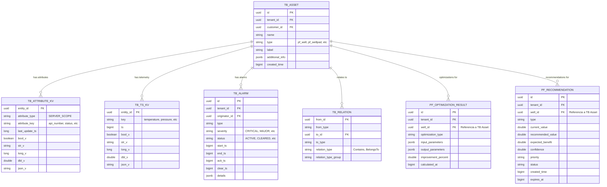

# DIAGRAMAS DE ARQUITECTURA - PF & PO Modules

**Proyecto**: Nexus Production Facilities & Optimization
**Versión**: 2.0
**Fecha**: 2026-02-03
**Arquitectura**: ThingsBoard Core (Assets, Attributes, ts_kv, Alarm System)
**Herramientas**: Mermaid, PlantUML

---

## 📋 Índice

1. [Arquitectura General](#arquitectura-general)
2. [Modelo de Datos (ERD)](#erd)
3. [Flujos de Datos](#flujos)
4. [Secuencias de Operación](#secuencias)
5. [Despliegue](#despliegue)

---

## 1. Arquitectura General {#arquitectura-general}

### 1.1 Arquitectura de Capas - ThingsBoard Core (Mermaid)


### 1.2 Arquitectura de Módulos PF y PO - ThingsBoard Native


### 1.3 Arquitectura de Servicios Wrapper


---

## 2. Modelo de Datos (ERD) {#erd}

### 2.1 Arquitectura de Datos - ThingsBoard Core

Este diagrama muestra cómo el módulo PF utiliza las tablas core de ThingsBoard en lugar de tablas custom.



### 2.2 Asset Types del Módulo PF


### 2.3 Comparación: Arquitectura Vieja vs Nueva


### 2.4 Entidades PO Module (Optimización)


---

## 3. Flujos de Datos {#flujos}

### 3.1 Flujo de Telemetría - ThingsBoard Rule Engine


### 3.2 Flujo de Creación de Asset (Well)


### 3.3 Flujo de Optimización ESP


### 3.4 Flujo de Predicción de Fallas


### 3.5 Flujo de Ejecución de Recomendación


---

## 4. Secuencias de Operación {#secuencias}

### 4.1 Creación de Pozo - ThingsBoard Assets (PlantUML)


### 4.2 Ciclo de Optimización Diario (PlantUML)


### 4.3 Procesamiento de Alarmas - ThingsBoard Alarm System (PlantUML)


---

## 5. Despliegue {#despliegue}

### 5.1 Arquitectura de Despliegue (Kubernetes)


### 5.2 Topología de Red


---

## 6. Diagramas de Estado

### 6.1 Estados de Recomendación


### 6.2 Estados de Alarma - ThingsBoard Alarm System


### 6.3 Ciclo de Vida de Asset


---

## 7. Componentes Frontend

### 7.1 Arquitectura de Componentes Angular

```mermaid
graph TB
    subgraph "PF Module Components"
        WellList[Well List Component]
        WellDetail[Well Detail Component]
        WellpadDash[Wellpad Dashboard]
        FlowStation[Flow Station Dashboard]
        AlarmList[TB Alarm Widget]

        WellList --> WellDetail
        WellpadDash --> WellDetail
    end

    subgraph "PO Module Components"
        OptDash[Optimization Dashboard]
        RecList[Recommendation List]
        RecDetail[Recommendation Detail]
        KpiDash[KPI Dashboard]
        HealthDash[Health Score Dashboard]

        OptDash --> RecList
        RecList --> RecDetail
    end

    subgraph "TB Core Services (Angular)"
        AssetSvc[AssetService<br/>TB Angular SDK]
        AttrSvc[AttributeService<br/>TB Angular SDK]
        AlarmSvc[AlarmService<br/>TB Angular SDK]
        TeleSvc[TelemetryService<br/>TB Angular SDK]
    end

    subgraph "PF/PO Custom Services"
        WellSvc[PfWellService]
        RecSvc[PoRecommendationService]
        KpiSvc[PoKpiService]
    end

    WellList --> WellSvc
    WellDetail --> WellSvc
    WellDetail --> TeleSvc
    AlarmList --> AlarmSvc

    RecList --> RecSvc
    KpiDash --> KpiSvc

    WellSvc --> AssetSvc
    WellSvc --> AttrSvc

    style WellDetail fill:#E3F2FD
    style RecDetail fill:#E8F5E9
```

### 7.2 Integración con ThingsBoard Widgets

```mermaid
graph TB
    subgraph "ThingsBoard Dashboard"
        DB[Dashboard]

        subgraph "Standard TB Widgets"
            AlarmTable[Alarm Table Widget]
            TsChart[Time-series Chart]
            EntityTable[Entity Table Widget]
            Map[Map Widget]
        end

        subgraph "Custom PF Widgets"
            WellStatus[Well Status Widget]
            EspDiagram[ESP Diagram Widget]
            ProductionGauge[Production Gauge]
        end

        subgraph "Custom PO Widgets"
            RecWidget[Recommendations Widget]
            HealthWidget[Health Score Widget]
            KpiWidget[KPI Summary Widget]
        end
    end

    subgraph "Data Sources"
        Assets[(TB Assets<br/>pf_well, pf_wellpad)]
        Attrs[(TB Attributes<br/>SERVER_SCOPE)]
        TsKv[(ts_kv<br/>Telemetry)]
        Alarms[(TB Alarms)]
        CustomTbl[(pf_recommendation<br/>pf_optimization_result)]
    end

    AlarmTable --> Alarms
    TsChart --> TsKv
    EntityTable --> Assets
    Map --> Assets

    WellStatus --> Attrs
    EspDiagram --> TsKv
    ProductionGauge --> TsKv

    RecWidget --> CustomTbl
    HealthWidget --> Attrs
    KpiWidget --> TsKv

    style AlarmTable fill:#FFF9C4
    style TsChart fill:#FFF9C4
    style EntityTable fill:#FFF9C4
```

---

## 8. Diagrama de Decisión Arquitectónica

### 8.1 ¿Cuándo usar Tabla Custom vs ThingsBoard Core?

```mermaid
flowchart TD
    START[Nueva entidad/dato] --> Q1{¿Es un objeto<br/>del dominio físico?}

    Q1 -->|Sí: Pozo, Equipo,<br/>Instalación| TB_ASSET[Usar TB Asset<br/>+ Attributes]

    Q1 -->|No| Q2{¿Es telemetría<br/>time-series?}

    Q2 -->|Sí: Temperatura,<br/>Presión, Flujo| TB_TS[Usar ts_kv<br/>TB Native]

    Q2 -->|No| Q3{¿Es una alarma<br/>o alerta?}

    Q3 -->|Sí: Límite excedido,<br/>Falla detectada| TB_ALARM[Usar TB Alarm<br/>System]

    Q3 -->|No| Q4{¿Tiene ciclo de vida<br/>complejo con workflow?}

    Q4 -->|Sí: Aprobaciones,<br/>Estados múltiples| CUSTOM[Tabla Custom<br/>Justificada]

    Q4 -->|No| Q5{¿Requiere queries<br/>analíticos complejos?}

    Q5 -->|Sí: Agregaciones,<br/>JOINs complejos| CUSTOM

    Q5 -->|No| TB_ASSET

    TB_ASSET --> EXAMPLES_ASSET[Ejemplos:<br/>pf_well, pf_esp_system<br/>ct_unit, rv_basin]

    TB_TS --> EXAMPLES_TS[Ejemplos:<br/>motor_temp, wellhead_pressure<br/>flow_rate_bpd]

    TB_ALARM --> EXAMPLES_ALARM[Ejemplos:<br/>HIGH_MOTOR_TEMP<br/>LOW_PRODUCTION<br/>ESP_FAILURE_PREDICTED]

    CUSTOM --> EXAMPLES_CUSTOM[Ejemplos:<br/>pf_recommendation<br/>pf_optimization_result<br/>ct_job, ct_fatigue_log]

    style TB_ASSET fill:#C8E6C9
    style TB_TS fill:#C8E6C9
    style TB_ALARM fill:#C8E6C9
    style CUSTOM fill:#FFECB3
```

---

## Uso de los Diagramas

### Renderizar Diagramas Mermaid
Los diagramas Mermaid se renderizan automáticamente en:
- GitHub
- GitLab
- VS Code (con extensión Mermaid)
- Confluence (con plugin)

### Renderizar Diagramas PlantUML
Para renderizar PlantUML:
```bash
# Instalar PlantUML
brew install plantuml

# Generar imágenes
plantuml DIAGRAMS.md
```

O usar servicios online:
- https://www.plantuml.com/plantuml/
- https://plantuml-editor.kkeisuke.com/

---

**Documento actualizado a arquitectura ThingsBoard Core con 20 diagramas visuales**

